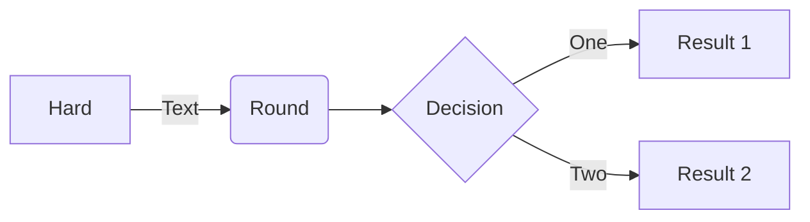

Проект-помощник по работе с Git:
=====================================

* создаем рабочую папку с названием
    `mkdir folderName`
* заходим в неё
    `cd folderName`
* заходим на [GitHub](https://github.com/svyatoslavlp?tab=repositories)
    жмём создать новый репозиторий и далее по инструции
    **не закрываем вкладку**
* возвращаемся в терминал и инициализируем репозиторий `git init`
* создаём файл README.md `touch README.md`
* добавляем его к фиксации  `git add README.md`
* создаём первый коммит `git commit -m "first commit"`
* переименовываем ветку в main `git branch -M main`
* возвращаемся на GitHub и копируем строку такого вида `git remote add origin git@github.com:svyatoslavlp/git-basics.git`  и выполняем её тем самым связывая текущий локальный репозиторий с репозиторием на GitHub
* засылаем изменения на GitHub `git push -u origin main`
* развернутый список коммитов `git log` сокращённый `git log --oneline`

HEAD -- это голова.
Коммит -- это всему голова.
Статусы файлов:

